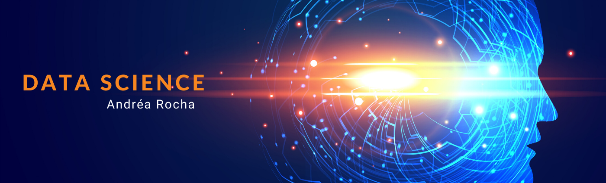

   

  

# Andréa Rocha
*Entusiasta de Data Science e Inteligência Artificial*

Sou doutora em engenharia elétrica, graduada em matemática e cofundadora do projeto Preparando Mentes. Atualmente, iniciei os meus estudos na área da Inteligência Artificial com o objetivo de analisar as mutações e polimorfismos nas sequências de DNA reproduzidas por códigos corretores de erros usados em sistemas de comunicações digitais.

**Background in:** Python, Machine Learning, Matemática e Sequências de DNA.

**Links:**
* [Site](http://www.andrearocha.mat.br)
* [LinkedIn](https://www.linkedin.com/in/andrearocha)
* [Medium](https://www.medium.com)

## Projetos:
Aqui você encontra os notebooks dos meus projetos desenvolvidos durante os cursos na área de Data Science:

* **Analisando a Violência no Rio de Janeiro:** https://bit.ly/violencia_rio.

---
